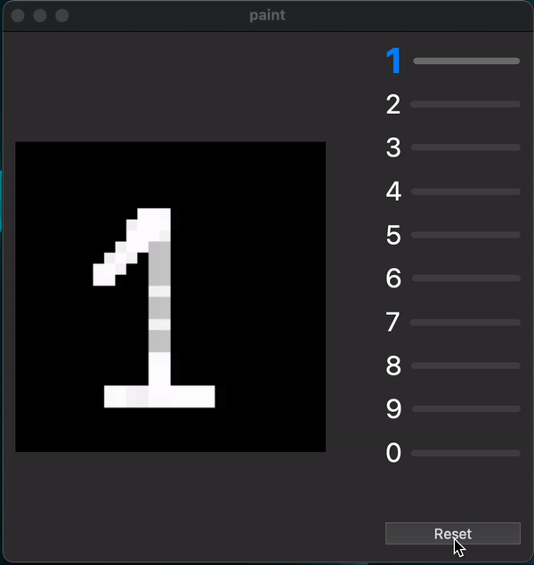

# NNFS - Neural Network From Scratch in C++ 

This is a pet project developed by [appxpy](https://github.com/appxpy) and [brazenoptimist](https://github.com/brazenoptimist) for educational purposes at the Higher School of Economics (HSE) in Moscow. The project aims to build a simple neural network from scratch using C++17.

NNFS includes the header-only core library "NNFS" that allows users to build their custom neural networks for educational purposes. Users can configure layers and activation functions according to their needs.

## Getting Started

To get started with NNFS, clone the repository and its submodules:

```bash
git clone --recursive https://github.com/appxpy/NNFS.git
```

## Prerequisites
- C++17 compatible compiler (tested with Clang 14 and GCC 12)
- CMake (version 3.14 or higher)

## Building
To build the project, navigate to the project directory and create a build folder:

```bash
cd NNFS
mkdir build
cd build
```

And then build with cmake:

```bash
cmake ..
make
```

## Architecture
The NNFS project is organized into the following directories:

- `include/NNFS`: Contains the header-only core library, which includes layers, activation functions, and loss functions.
- `tools`: Contains the source code for the built executables for training and interactive paint testing.
- `tests`: Contains test cases for the core library using the Google Test framework.
- `external`: Contains submodules for the Eigen and Google Test libraries.

## Documentation
The complete documentation for the NNFS project can be found at [appxpy.github.io/NNFS](https://appxpy.github.io/NNFS).

## Dependencies

The NNFS project relies on the following libraries:

- **Eigen**: A high-level C++ library for linear algebra, which is included as a submodule in the `external/eigen` directory.
- **Google Test**: A C++ testing framework, which is included as a submodule in the `external/googletest` directory.

## Testing

The NNFS project was tested using Clang 14 and GCC 12.

To run the tests, navigate to the `build` directory and execute the following commands:

```bash
cd tests
./nnfs_tests
```


## Examples

An example of using the NNFS library to create a custom neural network can be found in the `tools` directory.

### **Training executable**

This program demonstrates how to create and train a neural network using the NNFS (Neural Network From Scratch) library. The neural network is trained on the MNIST dataset, which consists of handwritten digit images. It could be found in `tools/train.cpp`.

The program performs the following steps:

1. Fetches the MNIST dataset and preprocesses it by rounding the pixel values to either 0 or 1.
2. Creates a model with an input layer, two hidden layers with ReLU activation, and an output layer.
3. Compiles the model by specifying the loss function (cross-entropy softmax) and the optimizer (Adam).
4. Trains the model on the training dataset with 20 epochs and a batch size of 128.
5. Saves the trained model to a file.
6. Loads the model from the file.
7. Evaluates the model's accuracy on the test dataset.
8. Makes predictions on a subset of the test dataset and compares them with the actual labels.

#### **Steps to Reproduce**

To create and train your own neural network using the NNFS library, follow these steps:

1. Install the NNFS library into your cmake project.
2. Download and preprocess the MNIST dataset (if not already available) using the fetch_mnist function.
3. Create the neural network model by adding layers to an instance of `NNFS::NeuralNetwork` class. For example:

```cpp
std::shared_ptr<NNFS::NeuralNetwork> model = std::make_shared<NNFS::NeuralNetwork>();
model->add_layer(std::make_shared<NNFS::Dense>(784, 128));
model->add_layer(std::make_shared<NNFS::ReLU>());
model->add_layer(std::make_shared<NNFS::Dense>(128, 128));
model->add_layer(std::make_shared<NNFS::ReLU>());
model->add_layer(std::make_shared<NNFS::Dense>(128, 10));
```
4. Compile the model by calling the compile method:

```cpp
model->compile();
```

5. Train the model on the training dataset using the `fit` method. Specify the number of epochs and the batch size. For example:

```cpp
model->fit(x_train, y_train, x_test, y_test, 20, 128);
```

6. Save the trained model to a file using the `save` method:

```cpp
std::string file_path = "path/to/save/model.bin";
model->save(file_path);
```

7. Load the saved model from the file using the `load` method:

```cpp
std::shared_ptr<NNFS::NeuralNetwork> model = std::make_shared<NNFS::NeuralNetwork>();
model->load(file_path);
```

8. Evaluate the model's accuracy on the test dataset using the `accuracy` method:

```cpp
double accuracy;
model->accuracy(accuracy, x_test, y_test);
std::cout << "Test set accuracy: " << accuracy << std::endl;
```

9. Make predictions using the `predict` method. Pass the input data to the method and obtain the predicted outputs:

```cpp
Eigen::MatrixXd predictions = model->predict(input_data);
```

10. Perform any necessary post-processing on the predictions and compare them with the actual labels to evaluate the model's performance.

Please note that this is a simplified explanation of the code. Additional code and configuration may be required depending on the specific implementation and requirements. If you need more information, please, follow the [documentation](https://appxpy.github.io/NNFS).

---

### **Paint application**

This interactive paint application allows users to draw on a canvas using a mouse and predicts the digit represented by the user's drawing using a neural network. The application is built using the Qt framework and the project's NNFS library.

#### **Features**

- Draw freely on the canvas using the mouse.
- Real-time prediction of the digit based on the user's drawing.
- Display of prediction probabilities for each digit.
- Highlighting of the predicted digit.


#### **Running the application**

To run the paint application, follow these steps:

1. Ensure that you have CMake (version 3.5 or higher) installed on your system.
2. Clone the repository and navigate to the project directory.
3. Build the project using CMake:
```bash
cmake .
make
```
4. Run the application, executable for your OS will be located into `build/tools/paint` folder.

5. As you draw, the application will predict the digit based on your drawing in real-time. The predicted digit, along with the prediction probabilities for each digit, will be displayed.

6. To clear the canvas and start a new drawing, click the "Restart" button.

#### **Example Usage**




## Contributing


We welcome contributions from anyone interested in improving the NNFS project. If you find a bug or have an idea for a new feature, please open an issue on the GitHub repository.

If you would like to contribute to the project, please follow these steps:

1. Fork the repository and clone it to your local machine.
2. Create a new branch for your changes.
3. Make your changes and test them thoroughly.
4. Commit your changes with a clear and descriptive message.
5. Push your changes to your forked repository.
6. Open a pull request on the GitHub repository.

Please note that all contributions are subject to review by the project maintainers.

## License

This project is licensed under the **MIT License**. Please see the LICENSE file for more information.

---

made with ❤️ by [appxpy](https://github.com/appxpy) & [brazenoptimist](https://github.com/brazenoptimist)